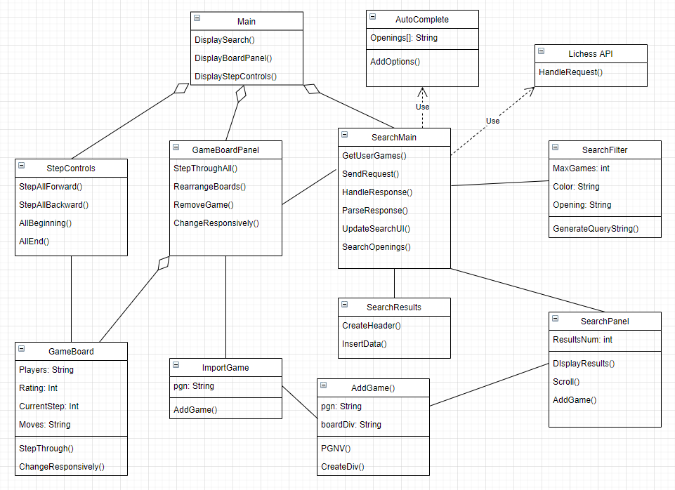
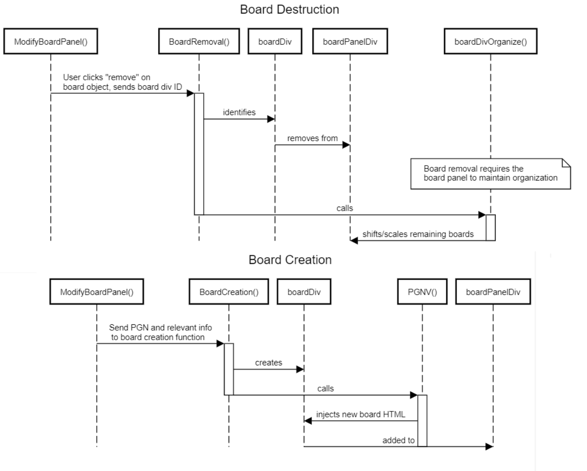
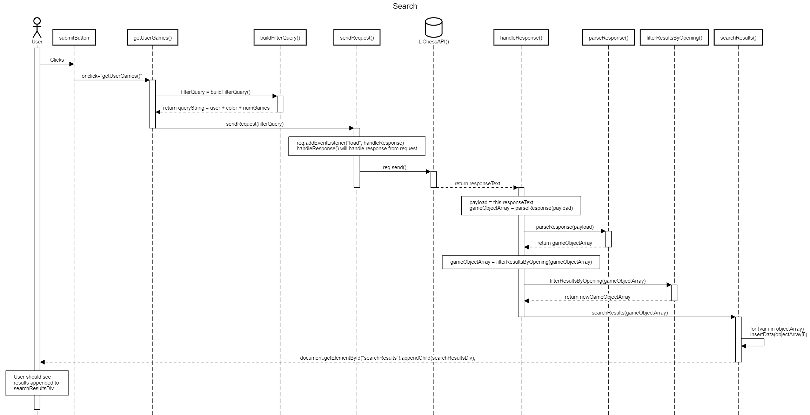

## Personas

#### Chess Coach (30 years old, high rated, paid to coach less experienced players)
By Jason Fleshel  
Andy Reid is a chess coach in New York City. He works with inexperienced students of all ages, ranging from teaching young children the basic rules of the game to improving the skills of lifelong players. Andy learned chess at a young age, and honed his skills playing against his grandfather. He has played in numerous competitions, yet has since retired to follow his passion of sharing his knowledge of the game with those who are less experienced. He is interested in using the LMBAT tool to compare different strategies and moves with his students.

#### Adult Chess Amateur (22 years old, only plays online, wonders why he always loses with a certain opening)
By Hao Long Li  
Hasbulla Magomedov is a small chess player with very little experience as he has only just started recently. He's been playing chess online with his rival Abdu Rozik and also many random players. Hasbulla loves using the Sicilian defense as it was recommended by his rival, however, he has a very high loss rate with it. So he has decided to use the Lichess Multi-Board Analysis Tool to help him explore all of his games with similar follow-up moves after the opening alongside each other to identify the issues from losing games and also what he did right for winning games.

#### Chess Lecturer (45+ years old, retired ex-pro, gives lectures at a local chess club, wants to present various openings with small deviations)
By Andy Phillips  
Yasser Seirawan is a legendary chess grandmaster and lecturer who often gives talks at the St. Louis Chess Club. A typical chess lecture involves a game board projected onto the screen and an instructive verbal analysis of that game is provided by the lecturer. Yasser has an idea for a lecture that involves comparing the Najdorf Sicilians of Maxime Vachier-Lagrave and Magnus Carlsen but this would require having multiple game boards open in multiple browser windows and stepping through each game individually. This is a tedious process for someone who is simultaneously trying to teach a full classroom the intricacies of the games. Using the Multi-Board Analysis Tool, Yasser is able to show four boards on the same screen: 2 of Maxime's games and 2 of Magnus's. He can step through every game at the same time while making his points about their unique deviations. 

#### Chess Noob Who Would Like to Improve (19 years old, freshman in college, has played chess his whole life but never learned any moves)
By Brian Durkin  
Nairb Nikrud has been playing chess since he was in 2nd grade. Almsost every day in his Gifted class, he would play against the other three kids in his class. He has always enjoyed a casual game of chess and has found it to be a fun and simple challenge for the brain. During high school, he stopped playing as much due to a heavy courseload. He just started his freshman year of college, which is very new to him obviously. Instead of going out to frat parties on the weekends, he has found that he likes to stay in with a couple of his new friends and play some chess against them. The one problem is: he gets stomped in every game. His friends were all members of the chess club in high school, so they know just about every move there is to know. He had no idea there were even moves in chess. Nairb's competitive nature does not allow him to quit, so instead he is determined to learn chess moves to compete with his friends. Our website will allow him to play a more competitive match with his friends.

## UML Diagram
The main page initializes the application by displaying the search panel and search functionality. It does so using the SearchHandler. By capturing user input from the search filter, the search handler is able to build and send a request to the Lichess API where we get all of our user game data. Once the search results are returned, each individual result presents a button to add the game to the GameBoardPanel. The GameBoardPanel houses all the game board organization functions. 

## Sequence Diagram 
The board management diagram contains the board addition and subtraction functionalities. The functions create or remove boardDivs which are added to or removed from the boardPanelDiv.

The search sequence diagram displays search functionalities. The user clicks the submit button, searchMain.js's functions retrieves data from the HTML inputs, utilizes them as search requests to the Lichess API, which will return the datas to searchResults.js where it will display returned results to the HTML page. 

## Product Vision

For chess players of all ages and skill levels who are interested in improving their chess skills through self-analysis, the Lichess Multi-Board Analysis Tool (LMBAT) is an extension of Lichess’s analytical toolkit that enables users to analyze multiple past games simultaneously to improve their understanding of how a given position can play out. 

Unlike most other chess analysis tools, the LMBAT allows you to step through multiple games simultaneously, side-by-side, to easily visualize how decisions made in those games can impact the outcome. 

## Weekly Update Documents 
	Week 1: https://github.com/tuc56407/Lichess-Multi-Board-Analysis-Tool/blob/develop/Week1.md  
	Week 2: https://github.com/tuc56407/Lichess-Multi-Board-Analysis-Tool/blob/develop/Week2.md  
	Week 3: https://github.com/tuc56407/Lichess-Multi-Board-Analysis-Tool/blob/develop/Week3.md  
	Week 4: https://github.com/tuc56407/Lichess-Multi-Board-Analysis-Tool/blob/develop/Week4.md 